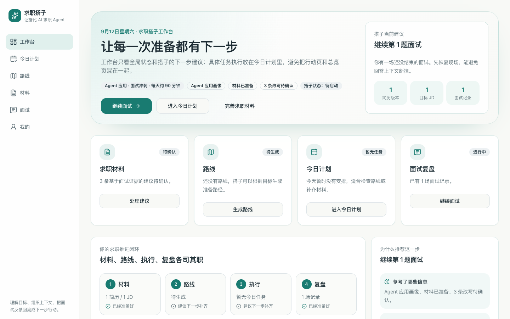
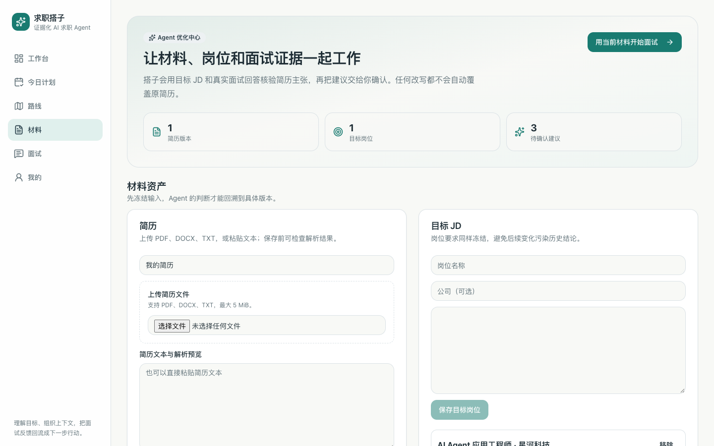
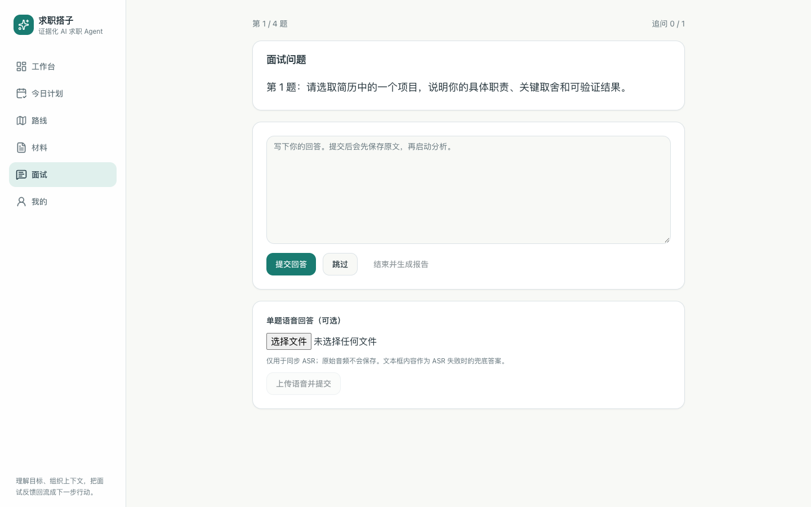
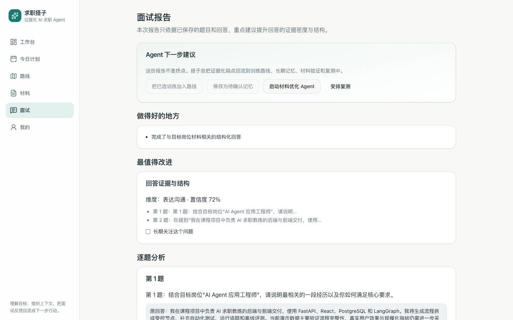
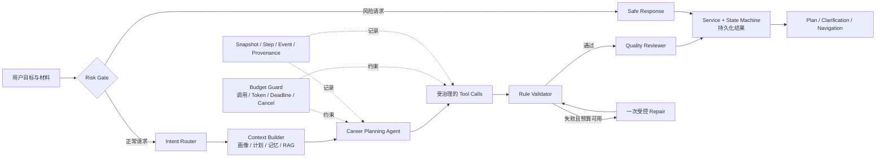
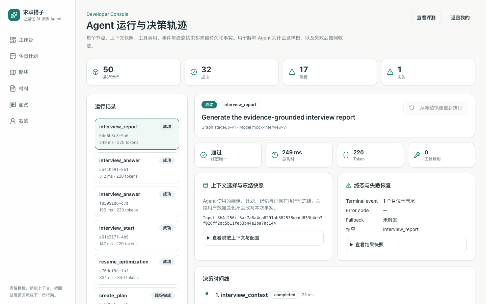
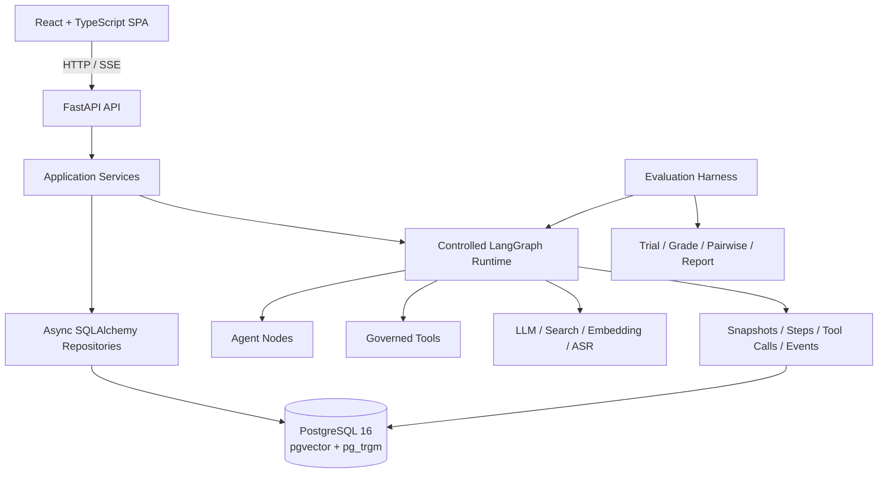

<div align="center">

# 求职搭子 · Career Planning Buddy

### 面向计算机专业学生的证据化 AI 求职教练

把简历、目标岗位、行动计划、执行复盘与模拟面试连接成一个可追踪、可恢复、可评测的闭环。

[快速体验](#快速体验) · [产品能力](#产品闭环) · [Agent 架构](#受控-agent-runtime) · [评测结果](#经过验证的结果) · [文档](#深入文档)

[](https://github.com/HHHAnQi/career-planning-buddy/actions/workflows/ci.yml)
[](LICENSE)


</div>



> **默认即可运行：**项目内置确定性的 Mock LLM、Search、Embedding 与 ASR Provider，
> 不需要 API Key，不会产生模型调用费用。

## 项目解决什么问题

计算机专业学生在求职过程中往往不缺零散建议，真正缺少的是连续行动和可验证反馈：

- 简历、目标 JD、项目准备和面试训练彼此割裂；
- 通用模型每轮从头回答，无法可靠继承真实执行结果；
- 建议缺少证据，执行之后也不知道下一步；
- Prompt 或 Provider 改动后，模型效果难以回归验证；
- Agent 如果可以任意修改简历、计划或记忆，用户很难建立信任。

Career Planning Buddy 将这些活动收敛成一个闭环：

```text
简历与目标 JD → 求职路线 → 7 天行动计划 → 每日执行与复盘
       ↑                                      ↓
简历新版本 ← 用户确认 ← 证据化建议 ← 模拟面试与报告
```

它不是让模型自由发挥的聊天机器人。关键写操作经过状态机、结构化校验和用户确认；
每次 Agent Run 的输入、节点、工具调用、事件、结果和降级原因均可追踪。

## 产品闭环

| 材料诊断与人工确认 | 模拟面试 |
| :---: | :---: |
|  |  |

<p align="center">
  
</p>

### 已实现能力

| 模块 | 能力 |
| --- | --- |
| 求职工作台 | 汇总画像、简历、目标 JD、路线、今日任务与面试状态，解释下一步建议依据 |
| 路线与执行 | 目标澄清、1–8 周方向、固定 7 天任务周期、每日进度、复盘与版本化重规划 |
| 求职材料 | 简历版本、JD 管理、主张—证据关联、逐条接受或拒绝建议、生成可回溯新版本 |
| 模拟面试 | 基于冻结简历与 JD 生成 4–6 题训练，支持追问、文本/单题音频回答与失败恢复 |
| 面试报告 | 保留原回答证据，生成优势、薄弱点、训练动作，并支持跨场次复测比较 |
| 记忆与 RAG | Run/Personal 双层记忆；pgvector + pg_trgm 混合检索、RRF、可替换 Reranker 与引用校验 |
| 开发者追踪 | 持久化 Run、Step、Tool、Event 和 Snapshot，支持执行审计、断线续传与 Eval 归因 |

## 受控 Agent Runtime

Career Planning Buddy 使用固定 LangGraph 和有界修复环，而不是开放式无限自主 Agent：



关键工程约束：

- Agent 节点不直接操作 ORM，写入统一经过 Service、状态机与事务；
- PostgreSQL lease、heartbeat 与 attempt fencing 支持中断恢复和过期执行隔离；
- 关键模型节点使用 durable checkpoint，故障恢复验证中没有重复 Provider 调用；
- Tool 统一经过 Schema、allowlist、次数、轮次和超时预算；
- LLM 结构化输出必须通过 Pydantic 校验，格式与业务修复均有明确上限；
- SSE 事件先写入 `agent_events`，再推送给客户端，支持断线续传；
- 简历改写和个人长期记忆进入后续上下文前需要用户确认。

<details>
<summary><strong>查看 Agent 运行与决策轨迹</strong></summary>



</details>

## 经过验证的结果

项目将冻结数据集、确定性 Grader、Trace 和真实 Provider 多次运行结合起来，避免仅凭少量 Demo
判断效果。

| 验证项 | 结果 |
| --- | ---: |
| Stage 5 真实 Provider 硬门禁通过率 | **72.2% → 88.9%** |
| 硬门禁 Wilson 95% CI | **[80.7%, 93.9%]** |
| 真实 Provider 延迟 P95 | **45.5s → 28.6s** |
| 转述硬化检索集 Hybrid Recall@5 / MRR | **1.00 / 0.95** |
| 自动化测试 | **814 项后端 + 36 项前端** |

完整的 90 次匿名 Trial、逐项 Grader、失败分解、冻结配置与 SHA256 校验和位于
[`backend/evals/releases/v0.3-hardgate-88.9/`](backend/evals/releases/v0.3-hardgate-88.9/)。

评测也记录负结果：在转述查询集上，神经 Reranker 将混合检索的 Recall@5 从 1.00
降低至 0.73，因此当前结论是“条件启用或融合分数”，而不是默认认为模型链路越复杂越好。

## 系统架构



后端保持单体分层：`api → services → repositories`。MVP 不引入 Redis、Celery、微服务、
MCP 或多 Agent 框架；异步 Run 由 PostgreSQL claim/lease/heartbeat 驱动。

## 快速体验

### 前置条件

- Docker Desktop 或 Docker Engine
- Docker Compose v2

### macOS / Linux

```bash
git clone https://github.com/HHHAnQi/career-planning-buddy.git
cd career-planning-buddy
cp .env.example .env
docker compose up --build -d
docker compose ps
curl http://127.0.0.1:8000/health/ready
```

### Windows PowerShell

```powershell
git clone https://github.com/HHHAnQi/career-planning-buddy.git
Set-Location career-planning-buddy
Copy-Item .env.example .env
docker compose up --build -d
docker compose ps
Invoke-RestMethod http://127.0.0.1:8000/health/ready
```

启动后访问：

- Web：[http://localhost:5173](http://localhost:5173)
- API 文档：[http://localhost:8000/docs](http://localhost:8000/docs)

首次进入后可注册账号或使用访客入口，完成最小画像，再从工作台体验材料、路线、任务和面试流程。

停止服务：

```bash
docker compose down
```

`docker compose down` 不会删除 PostgreSQL 命名卷。真实 Provider 的配置方式见
[Provider 配置与部署](docs/third-party-integration/provider-configuration.md)。

## 技术栈

| 层次 | 技术 |
| --- | --- |
| Frontend | React、TypeScript、Vite、React Router、TanStack Query、Tailwind CSS |
| Backend | Python 3.12、FastAPI、Pydantic v2、SQLAlchemy 2 Async、Alembic |
| Agent | LangGraph、Provider Protocol、Budget Guard、Tool Registry、Durable Checkpoint |
| Data | PostgreSQL 16、pgvector、pg_trgm |
| Quality | Pytest、Vitest、Ruff、Mypy、OpenAPI Snapshot、Evaluation Harness |
| Delivery | Docker Compose、GitHub Actions |

## 项目结构

```text
career-planning-buddy/
├── backend/
│   ├── app/                 # API、Service、Repository、Agent、Provider、Harness
│   ├── alembic/             # 数据库迁移
│   ├── evals/               # 数据集、评测框架与冻结发布工件
│   └── tests/               # Schema、Service、Repository、API、Runtime 测试
├── frontend/src/            # 页面、组件、API Client、路由与前端测试
├── docs/                    # 产品、架构、契约、实现、标准与审查文档
├── scripts/                 # 跨前后端验收脚本
├── compose.yaml
└── .env.example             # 无密钥的 Mock 配置模板
```

## 测试与评测

```bash
./scripts/check.sh
```

Windows：

```powershell
.\scripts\check.ps1
```

标准验收包含 Ruff、Mypy、Alembic、Pytest、离线评测冒烟、Vitest 和前端生产构建。
CI 强制使用 Mock Provider，不读取开发者真实密钥，也不会产生付费调用。

## 深入文档

| 主题 | 文档 |
| --- | --- |
| 产品说明与演示 | [产品概览](docs/overview/product-overview.md) · [5 分钟演示](docs/overview/demo-walkthrough.md) |
| 当前系统和限制 | [Current System Overview](docs/architecture/current-system-overview.md) |
| Agent Runtime | [Runtime Contract](docs/model-design/agent-runtime/README.md) |
| Tool 治理 | [Tool Contract](docs/model-design/tools/README.md) |
| API 与数据模型 | [API](docs/model-design/api-spec/README.md) · [Data Models](docs/model-design/data-models/README.md) |
| Eval 与质量标准 | [SLO](docs/standards/slo.md) · [Metric Registry](docs/standards/metric-registry.md) |
| 架构决策 | [Architecture](docs/architecture/README.md) |
| 全部文档 | [Documentation Index](docs/README.md) |

## 安全与限制

- 简历、JD、面试回答和个人记忆属于敏感数据；项目默认面向本地部署，不提供公共托管实例；
- 当前部署形态为单机、单后端 Worker，尚未完成多 Worker HA 和大规模真实流量验证；
- Agent Run 支持数据库租约恢复，但不宣称所有外部 LLM 调用 exactly-once；
- 真实 Provider 的按调用成本记账尚未完全接线；
- 面试与简历建议属于训练辅助，不等同于招聘、背景调查或专业法律意见。

安全问题请遵循 [SECURITY.md](SECURITY.md)，贡献代码前请阅读
[CONTRIBUTING.md](CONTRIBUTING.md)。

## License

[MIT](LICENSE) © 2026 Li Ye
